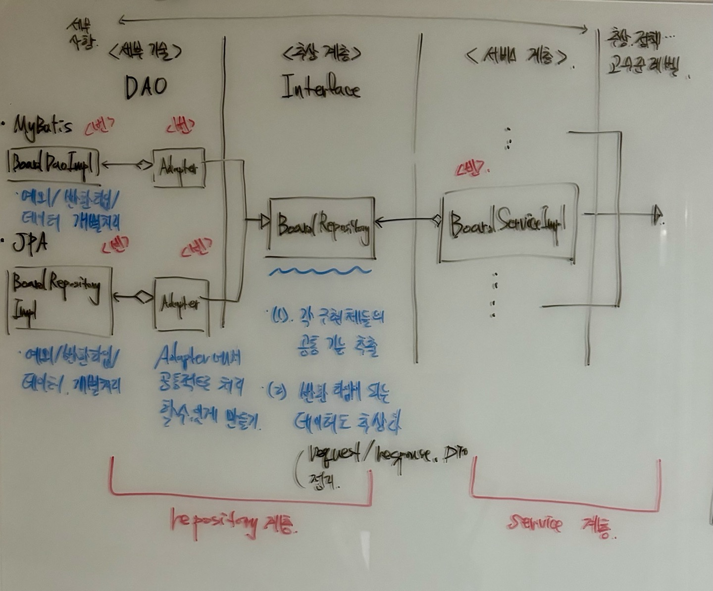
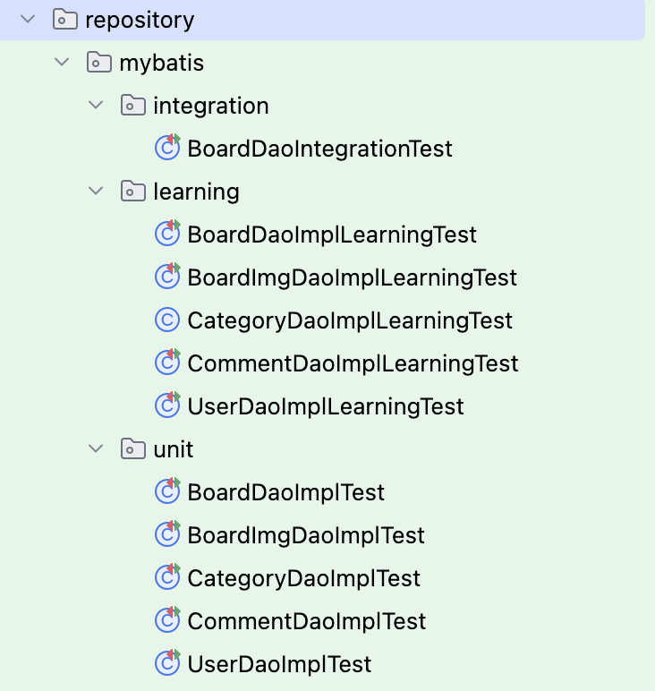
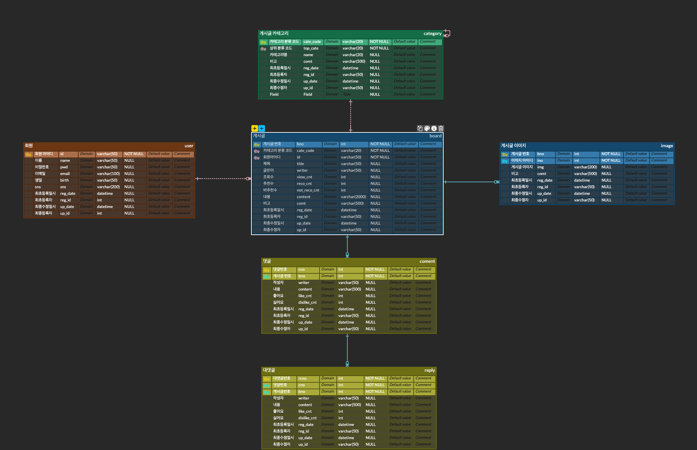

# Connecting Dots ✨


## 📢 프로젝트 소개
> 어렸을 때 하늘을 보면서 서로 멀리 떨어진 별들을 손가락으로 연결해본적 있나요? 저는 자주 그랬습니다
> 우리도 서로 멀리 떨어져 있으나 별들을  손으로 연결하듯이 이 프로젝트를 통해서 우리의 순간들이 이어지지 않을까요?
> 이 생각으로 시작한 <strong>“Connecting Dots”</strong> 프로젝트를 소개합니다

_벤치마킹 사이트: 

<br>

### 🏃🏻 프로젝트 기간 (30 days)
> **전체 개발 기간: 2024.10.08 ~ 진행중 (4 Weeks | 60 %)**
> - 기능 구현 기간: 2024.04.15 ~ 2024.05.19 (3 Weeks | 80 %) <br>
> - UI 구현 기간: 2024.05.20 ~ 2024.05.28 (1 Week | 0 %) <br>


<br>

### 🤔 기술적 고민과 적용과정

> ### 1. 변경에 유리한 구조 설계 -> "세부 기술로 부터 추상화" [❌(적용 계획)]
> - 
> - 현재 프로젝트에서 사용하는 DAO 기술은 MyBatis와 JPA가 있다.
> - 하지만, 두 기술은 세부 처리 내용(코드)이 다름. 이를 스프링의 PSA와 같이 추상화함
> - 즉, 세부 기술 처리 로직이 그 상위 모듈에 영향을 주지 않게 설계함
>   - 이 과정에서 사용한 디자인 패턴은 Adapter Pattern
>   - 또한, DTO와 처리 기능을 추상화시킴 
>   
> - <strong>스프링의 핵심 기능 중 하나인 PSA와 유사하게 적용함</strong>

> ### 2. 넓은 범위의 테스트 작성 -> "통합 테스트/학습 테스트/단위 테스트 적용" [✅]
> - 
> - 현재 프로젝트의 테스트 구조를 보면 크게 3가지 부분으로 나뉨
>   - (1) integration : 통합 테스트
>   - (2) learning : 학습 테스트
>   - (3) unit : 단위 테스트
> 
> - 내가 구현한 기능에 대해 "학습 테스트"를 통해 충분히 학습함. 예를들어서, 테이블 제약 조건을 위반할 경우 어떤 예외가 발생할지 학습.
> - 이를 통해, 내가 구현한 기능에 대한 이해도를 높이고 넓은 범위의 "테스트 코드"를 작성함.
> - 마지막으로 "통합 테스트"를 통해 전체 기능에 대한 검증을 함.


> ### 3. 중요한 데이터 처리는 재시도를 통한 복구 시도 -> "재시도에 대한 전략과 @Retryable을 활용함" [✅]
> - 게시글을 작성하거나 수정하는 과정은 해당 애플리케이션의 핵심 기능
> - 따라서, DB 네트워크 장애로 인해 데이터 등록이나 수정 처리가 제대로 이루어지지 않을 경우 재시도를 통해 복구함
> - 물론, 재시도를 어떻게 할지에 대한 전략을 세웠고 해당 전략에 따라 수행함
>   - 재시도 횟수는 10 번
>   - 대기 시간은 5초 
>   
> - 아래 코드 참고 

```java
// 추후에 첨부(코드 정리되면) 

```

> ### 4. AOP 적용 -> "특정 예외를 예외정책에 따라 정의된 애플리케이션 예외로 변환하는 과정을 AOP로 처리" [❌(적용 계획)]
>

```java
// 추후에 첨부(코드 정리되면) 

```


<br>

### 👨🏻‍💻 코드 라인 
<pre><code>Java         : 10,000 <br>
JavaScript   : 894 <br> </code></pre> 


## 기술 스택

<br>

### 🛠️ Tool

#### Backend

#### Frontend

#### Database

#### Web Server

<br>


## ERD



<br>
<br>

## Commit Message Convention
###  🤝 규칙
<pre><code>- 제목 행 명령문 사용
- 제목과 본문을 빈 행으로 분리
- 제목 행 글자 수 50자 이하
- 제목 행 끝에 마침표 없음</code></pre>

###  📚 유형
<pre><code>[feat]        :     새로운 기능 추가
[test]        :     테스트 코드 완료 
[refactor]    :     리팩토링, 코드 개선
[fix]         :     버그 수정
[docs]        :     문서 추가 또는 수정 (ex. README 변경)
[style]       :     코드 스타일 변경 (포맷팅, 세미콜론 누락 등 코드 변경이 없는 경우)
[chore]       :     패키지 매니저(ex. gitignore 수정), 빌드 업무 수정
[comment]     :     주석 추가 및 수정
[rename]      :     파일 또는 폴더명을 수정하거나 이동하는 작업만 수행한 경우
[remove]      :     파일을 삭제하는 작업만 수행한 경우
[conflict]    :     합병 시 발생한 충돌 수정</code></pre>

<br>

## 프로젝트 구조


## 주요 기능

