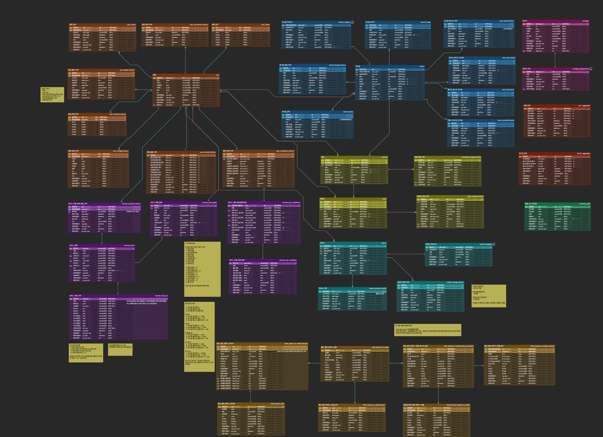

# Connecting Dots ✨

## 📢 개인 프로젝트 소개
> 어렸을 때 하늘을 보면서 서로 멀리 떨어진 별들을 손가락으로 연결해본적 있나요? 저는 자주 그랬습니다
> <strong>우리도 서로 멀리 떨어져 있으나 별들을  손으로 연결하듯이 이 프로젝트를 통해서 우리의 순간들이 이어지지 않을까요?</strong>
> 이 생각으로 시작한 <strong>“Connecting Dots”</strong> 프로젝트를 소개합니다🥳

_벤치마킹 사이트: 디시인사이드, 티스토리

 

### 🏃🏻 프로젝트 기간 (진행중)
> **전체 개발 기간: 2024.12.25 ~ 진행중 ( Weeks |  %)**
> - 서비스 정의 및 설계 :  
> - 기능 구현 기간:   
> - UI 구현 기간:  
> (해당 프로젝트는 기존에 작은 규모에서 시작하다가 추후에 설계 단계부터 다시 시작하여 규모를 키웠습니다. 따라서, 프로젝트 기간도 설계 단계를 시작할 때부터 측정을 했습니다.)

 

### 📅 프로젝트 세부 일정 (진행중)
> - (1) 정책 사항 수립 : 2024.12.25 ~ 2025.01.03 
> - (2) 벤츠마킹 및 모델링 설계 : 2025.01.03 ~ 진행중 
> - (3) 개발 진행 : 
> - (4) UI 구현 : 

 

### 🎥 프로젝트 시연 연상 
> 

 

### 🧱 프로젝트 설계(ERD)

> 
>
> - 테이블 수 : 44
 

 

### 🧑🏻‍🏫 프로젝트 상세 설명

> ### 1. 프로젝트 시연 과정 👀
> 
> ### 2. 프로젝트 작업 중 학습하고 고민한 부분!! 🤔
> 
> ### 3. 프로젝트 각 단계별로 어떤식으로 작업을 진행했는지?  🧱
> 

 

### 👨🏻‍💻 코드 라인 
> ### 1. 백엔드 작업 코드 라인 
> - <strong> Java         : 50,000 + a 라인 </strong>
> - <strong> 백엔드 테스트 코드 : 2,300 + a 개 </strong>
>  
> 
> ### 2. 프론트엔드 작업 코드 라인
> - JavaScript   : 5,000 + a 라인
> - HTML         : 1,000 + a 라인
> - CSS          : 1,000 + a 라인
> - 기타         : 1,000 + a 라인

### 🛠️ 기술 스택

 

### ⚙️ 인프라

 

### 🏛️ 아키텍쳐 

#### - Infrastructure 

#### - CI/CD

 
 

## 주요 기능

